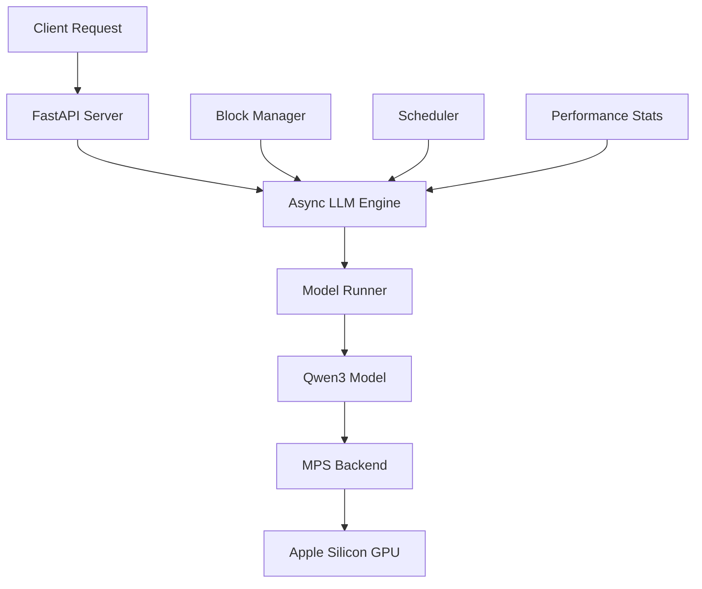

# Nano Qwen3 Serving

<div align="center">


**High-performance OpenAI-compatible API server for Qwen3 models optimized for Apple Silicon**

[Quick Start](getting-started/quick-start.md){ .md-button .md-button--primary }
[API Reference](user-guide/api-reference.md){ .md-button }
[GitHub](https://github.com/hsliuustc/nano-qwen3-serving){ .md-button .md-button--secondary }

</div>

## 🚀 Overview

Nano Qwen3 Serving is a lightweight, high-performance API server that provides OpenAI-compatible endpoints for Qwen3 models. It's specifically optimized for Apple Silicon (M1/M2/M3) with Metal Performance Shaders (MPS) acceleration, making it perfect for local AI development and production deployments.

### ✨ Key Features

- **🚀 OpenAI-Compatible API**: Drop-in replacement for OpenAI API
- **🍎 Apple Silicon Optimized**: Native MPS acceleration for maximum performance
- **⚡ High Performance**: Efficient token generation with streaming support
- **🔧 Easy Deployment**: Simple setup with minimal dependencies
- **📊 Real-time Monitoring**: Built-in performance metrics and health checks
- **🔄 Streaming Support**: Server-Sent Events (SSE) for real-time responses
- **🎯 Production Ready**: Robust error handling and graceful shutdown

### 🎯 Use Cases

- **Local AI Development**: Run Qwen3 models locally for development and testing
- **API Proxy**: Serve as a proxy for OpenAI-compatible applications
- **Edge Computing**: Deploy on Apple Silicon devices for edge AI inference
- **Research & Experimentation**: Fast iteration with different models and parameters
- **Production Services**: Scalable API endpoints for production applications

## 🏗️ Architecture



## 📈 Performance

| Model | Parameters | Memory | Speed (tokens/s) | Device |
|-------|------------|--------|------------------|--------|
| Qwen3-0.6B | 596M | ~2GB | 50-100 | M1/M2/M3 |
| Qwen3-1.5B | 1.5B | ~4GB | 30-60 | M1/M2/M3 |
| Qwen3-3B | 3B | ~8GB | 20-40 | M1/M2/M3 |

*Performance may vary based on hardware configuration and model size*

## 🚀 Quick Start

### 1. Installation

```bash
pip install nano-qwen3-serving
```

### 2. Start the Server

```bash
python -m nano_qwen3_serving --port 8000
```

### 3. Make a Request

```python
import requests

response = requests.post("http://localhost:8000/v1/chat/completions", json={
    "model": "Qwen/Qwen3-0.6B",
    "messages": [{"role": "user", "content": "Hello, how are you?"}],
    "stream": False
})

print(response.json()["choices"][0]["message"]["content"])
```

## 📚 Documentation Sections

### 🎯 Getting Started
- **[Quick Start](getting-started/quick-start.md)**: Get up and running in minutes
- **[Installation](getting-started/installation.md)**: Detailed installation guide
- **[Configuration](getting-started/configuration.md)**: Server configuration options

### 📖 User Guide
- **[Basic Usage](user-guide/basic-usage.md)**: Learn the fundamentals
- **[API Reference](user-guide/api-reference.md)**: Complete API documentation
- **[Streaming](user-guide/streaming.md)**: Real-time streaming responses
- **[Models](user-guide/models.md)**: Supported models and configurations

### 🔧 API Documentation
- **[Server API](api/server.md)**: Server endpoints and health checks
- **[Chat Completions](api/chat-completions.md)**: Chat completion API
- **[Models API](api/models.md)**: Model information endpoints
- **[Health Check](api/health.md)**: Health monitoring endpoints

### 🛠️ Development
- **[Architecture](development/architecture.md)**: System architecture overview
- **[Contributing](development/contributing.md)**: How to contribute
- **[Testing](development/testing.md)**: Testing guidelines

### 🔍 Troubleshooting
- **[Common Issues](troubleshooting/common-issues.md)**: Solutions to common problems
- **[Performance](troubleshooting/performance.md)**: Performance optimization
- **[Debugging](troubleshooting/debugging.md)**: Debugging techniques

### 💡 Examples
- **[Basic Examples](examples/basic-examples.md)**: Simple usage examples
- **[Advanced Examples](examples/advanced-examples.md)**: Complex use cases
- **[Client Libraries](examples/client-libraries.md)**: Integration examples

## 🤝 Contributing

We welcome contributions! Please see our [Contributing Guide](development/contributing.md) for details.

## 📄 License

This project is licensed under the MIT License - see the [LICENSE](https://github.com/hsliuustc/nano-qwen3-serving/blob/main/LICENSE) file for details.

## 🙏 Acknowledgments

- [Qwen Team](https://github.com/QwenLM) for the amazing Qwen3 models
- [FastAPI](https://fastapi.tiangolo.com/) for the excellent web framework
- [Hugging Face](https://huggingface.co/) for the transformers library
- [Apple](https://developer.apple.com/metal/) for Metal Performance Shaders

---

<div align="center">

**Made with ❤️ for the AI community**

[GitHub](https://github.com/hsliuustc/nano-qwen3-serving) • [Issues](https://github.com/hsliuustc/nano-qwen3-serving/issues) • [Discussions](https://github.com/hsliuustc/nano-qwen3-serving/discussions)

</div>
